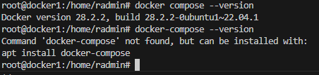
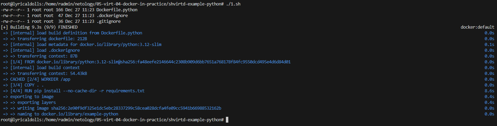
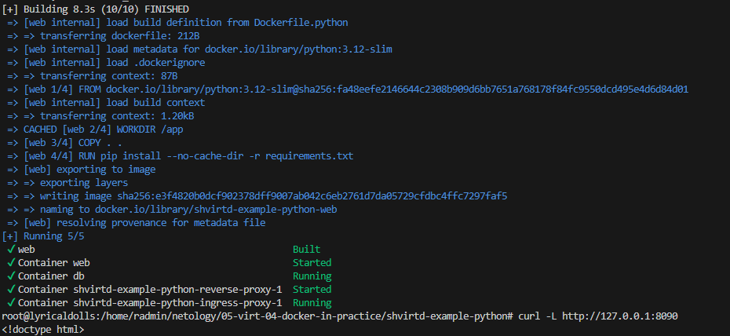
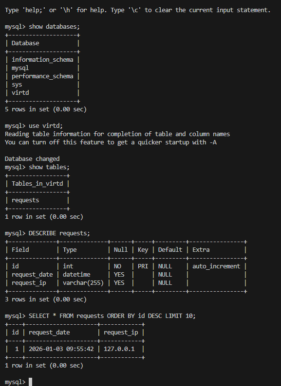
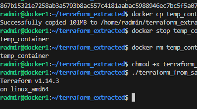
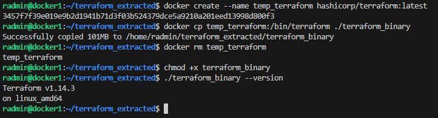

# 05-virt-04-docker-in-practice

# Задание к занятию 5. «Практическое применение Docker»

---

## Примечание: Ознакомьтесь со схемой виртуального стенда [по ссылке](https://github.com/netology-code/shvirtd-example-python/blob/main/schema.pdf)

---

## Задача 0
1. Убедитесь что у вас НЕ(!) установлен ```docker-compose```, для этого получите следующую ошибку от команды ```docker-compose --version```
```
Command 'docker-compose' not found, but can be installed with:

sudo snap install docker          # version 24.0.5, or
sudo apt  install docker-compose  # version 1.25.0-1

See 'snap info docker' for additional versions.
```
В случае наличия установленного в системе ```docker-compose``` - удалите его.  
2. Убедитесь что у вас УСТАНОВЛЕН ```docker compose```(без тире) версии не менее v2.24.X, для это выполните команду ```docker compose version```  
###  **Своё решение к задачам оформите в вашем GitHub репозитории!!!!!!!!!!!!!!!!!!!!!!!!!!!!!!!!**

## Ответ на задание 0




---

## Задача 1
1. Сделайте в своем GitHub пространстве fork [репозитория](https://github.com/netology-code/shvirtd-example-python).

2. Создайте файл ```Dockerfile.python``` на основе существующего `Dockerfile`:
   - Используйте базовый образ ```python:3.12-slim```
   - Обязательно используйте конструкцию ```COPY . .``` в Dockerfile
   - Создайте `.dockerignore` файл для исключения ненужных файлов
   - Используйте ```CMD ["uvicorn", "main:app", "--host", "0.0.0.0", "--port", "5000"]``` для запуска
   - Протестируйте корректность сборки 
3. (Необязательная часть, *) Изучите инструкцию в проекте и запустите web-приложение без использования docker, с помощью venv. (Mysql БД можно запустить в docker run).
4. (Необязательная часть, *) Изучите код приложения и добавьте управление названием таблицы через ENV переменную.
---
### ВНИМАНИЕ!
!!! В процессе последующего выполнения ДЗ НЕ изменяйте содержимое файлов в fork-репозитории! Ваша задача ДОБАВИТЬ 5 файлов: ```Dockerfile.python```, ```compose.yaml```, ```.gitignore```, ```.dockerignore```,```bash-скрипт```. Если вам понадобилось внести иные изменения в проект - вы что-то делаете неверно!
---

## Ответ на задание 1



## Задача 2 (*)
1. Создайте в yandex cloud container registry с именем "test" с помощью "yc tool" . [Инструкция](https://cloud.yandex.ru/ru/docs/container-registry/quickstart/?from=int-console-help)
2. Настройте аутентификацию вашего локального docker в yandex container registry.
3. Соберите и залейте в него образ с python приложением из задания №1.
4. Просканируйте образ на уязвимости.
5. В качестве ответа приложите отчет сканирования.

## Задача 3
1. Изучите файл "proxy.yaml"
2. Создайте в репозитории с проектом файл ```compose.yaml```. С помощью директивы "include" подключите к нему файл "proxy.yaml".
3. Опишите в файле ```compose.yaml``` следующие сервисы: 

- ```web```. Образ приложения должен ИЛИ собираться при запуске compose из файла ```Dockerfile.python``` ИЛИ скачиваться из yandex cloud container registry(из задание №2 со *). Контейнер должен работать в bridge-сети с названием ```backend``` и иметь фиксированный ipv4-адрес ```172.20.0.5```. Сервис должен всегда перезапускаться в случае ошибок.
Передайте необходимые ENV-переменные для подключения к Mysql базе данных по сетевому имени сервиса ```web``` 

- ```db```. image=mysql:8. Контейнер должен работать в bridge-сети с названием ```backend``` и иметь фиксированный ipv4-адрес ```172.20.0.10```. Явно перезапуск сервиса в случае ошибок. Передайте необходимые ENV-переменные для создания: пароля root пользователя, создания базы данных, пользователя и пароля для web-приложения.Обязательно используйте уже существующий .env file для назначения секретных ENV-переменных!

2. Запустите проект локально с помощью docker compose , добейтесь его стабильной работы: команда ```curl -L http://127.0.0.1:8090``` должна возвращать в качестве ответа время и локальный IP-адрес. Если сервисы не стартуют воспользуйтесь командами: ```docker ps -a ``` и ```docker logs <container_name>``` . Если вместо IP-адреса вы получаете информационную ошибку --убедитесь, что вы шлете запрос на порт ```8090```, а не 5000.

5. Подключитесь к БД mysql с помощью команды ```docker exec -ti <имя_контейнера> mysql -uroot -p<пароль root-пользователя>```(обратите внимание что между ключем -u и логином root нет пробела. это важно!!! тоже самое с паролем) . Введите последовательно команды (не забываем в конце символ ; ): ```show databases; use <имя вашей базы данных(по-умолчанию example)>; show tables; SELECT * from requests LIMIT 10;```.

6. Остановите проект. В качестве ответа приложите скриншот sql-запроса.

## Ответ на задание 3




## Задача 4
1. Запустите в Yandex Cloud ВМ (вам хватит 2 Гб Ram).
2. Подключитесь к Вм по ssh и установите docker.
3. Напишите bash-скрипт, который скачает ваш fork-репозиторий в каталог /opt и запустит проект целиком.
4. Зайдите на сайт проверки http подключений, например(или аналогичный): ```https://check-host.net/check-http``` и запустите проверку вашего сервиса ```http://<внешний_IP-адрес_вашей_ВМ>:8090```. Таким образом трафик будет направлен в ingress-proxy. Трафик должен пройти через цепочки: Пользователь → Internet → Nginx → HAProxy → FastAPI(запись в БД) → HAProxy → Nginx → Internet → Пользователь
5. (Необязательная часть) Дополнительно настройте remote ssh context к вашему серверу. Отобразите список контекстов и результат удаленного выполнения ```docker ps -a```
6. Повторите SQL-запрос на сервере и приложите скриншот и ссылку на fork.

## Ответ на задание 3

Пока не получилось, ищу
```
radmin@docker1:/opt/shvirtd-example-python$ docker compose logs reverse-proxy
WARN[0000] /opt/shvirtd-example-python/proxy.yaml: the attribute `version` is obsolete, it will be ignored, please remove it to avoid potential confusion 
reverse-proxy-1  | [WARNING]  (1) : config : missing timeouts for frontend 'http_front'.
reverse-proxy-1  |    | While not properly invalid, you will certainly encounter various problems
reverse-proxy-1  |    | with such a configuration. To fix this, please ensure that all following
reverse-proxy-1  |    | timeouts are set to a non-zero value: 'client', 'connect', 'server'.
reverse-proxy-1  | [WARNING]  (1) : config : missing timeouts for backend 'http_back'.
reverse-proxy-1  |    | While not properly invalid, you will certainly encounter various problems
reverse-proxy-1  |    | with such a configuration. To fix this, please ensure that all following
reverse-proxy-1  |    | timeouts are set to a non-zero value: 'client', 'connect', 'server'.
reverse-proxy-1  | [WARNING]  (8) : Server http_back/web is DOWN, reason: Layer4 connection problem, info: "Connection refused", check duration: 0ms. 0 active and 0 backup servers left. 0 sessions active, 0 requeued, 0 remaining in queue.
reverse-proxy-1  | [NOTICE]   (1) : New worker #1 (8) forked
reverse-proxy-1  | [NOTICE]   (8) : haproxy version is 2.4.30-bfe53a9
reverse-proxy-1  | [NOTICE]   (8) : path to executable is /usr/local/sbin/haproxy
reverse-proxy-1  | [ALERT]    (8) : backend 'http_back' has no server available!
reverse-proxy-1  | [WARNING]  (8) : Server http_back/web is UP, reason: Layer4 check passed, check duration: 0ms. 1 active and 0 backup servers online. 0 sessions requeued, 0 total in queue.
reverse-proxy-1  | [WARNING]  (1) : Exiting Master process...
reverse-proxy-1  | [WARNING]  (8) : Proxy http_front stopped (cumulated conns: FE: 0, BE: 0).
reverse-proxy-1  | [WARNING]  (8) : Stopping backend http_back in 0 ms.
reverse-proxy-1  | [WARNING]  (8) : Stopping frontend GLOBAL in 0 ms.
reverse-proxy-1  | [WARNING]  (1) : Current worker #1 (8) exited with code 0 (Exit)
reverse-proxy-1  | [WARNING]  (1) : All workers exited. Exiting... (0)
reverse-proxy-1  | [WARNING]  (1) : config : missing timeouts for frontend 'http_front'.
reverse-proxy-1  |    | While not properly invalid, you will certainly encounter various problems
reverse-proxy-1  |    | with such a configuration. To fix this, please ensure that all following
reverse-proxy-1  |    | timeouts are set to a non-zero value: 'client', 'connect', 'server'.
reverse-proxy-1  | [WARNING]  (1) : config : missing timeouts for backend 'http_back'.
reverse-proxy-1  |    | While not properly invalid, you will certainly encounter various problems
reverse-proxy-1  |    | with such a configuration. To fix this, please ensure that all following
reverse-proxy-1  |    | timeouts are set to a non-zero value: 'client', 'connect', 'server'.
reverse-proxy-1  | [NOTICE]   (1) : New worker #1 (9) forked
radmin@docker1:/opt/shvirtd-example-python$ docker compose logs web
WARN[0000] /opt/shvirtd-example-python/proxy.yaml: the attribute `version` is obsolete, it will be ignored, please remove it to avoid potential confusion 
web  | INFO:     Started server process [1]
web  | INFO:     Waiting for application startup.
web  | INFO:     Application startup complete.
web  | INFO:     Uvicorn running on http://0.0.0.0:5000 (Press CTRL+C to quit)
radmin@docker1:/opt/shvirtd-example-python$ 
```

## Задача 5 (*)
1. Напишите и задеплойте на вашу облачную ВМ bash скрипт, который произведет резервное копирование БД mysql в директорию "/opt/backup" с помощью запуска в сети "backend" контейнера из образа ```schnitzler/mysqldump``` при помощи ```docker run ...``` команды. Подсказка: "документация образа."
2. Протестируйте ручной запуск
3. Настройте выполнение скрипта раз в 1 минуту через cron, crontab или systemctl timer. Придумайте способ не светить логин/пароль в git!!
4. Предоставьте скрипт, cron-task и скриншот с несколькими резервными копиями в "/opt/backup"

## Задача 6
Скачайте docker образ ```hashicorp/terraform:latest``` и скопируйте бинарный файл ```/bin/terraform``` на свою локальную машину, используя dive и docker save.
Предоставьте скриншоты  действий .

## Ответ на задание 6




## Задача 6.1
Добейтесь аналогичного результата, используя docker cp.  
Предоставьте скриншоты  действий .

## Ответ на задание 6.1



## Задача 6.2 (**)
Предложите способ извлечь файл из контейнера, используя только команду docker build и любой Dockerfile.  
Предоставьте скриншоты  действий .

## Задача 7 (***)
Запустите ваше python-приложение с помощью runC, не используя docker или containerd.  
Предоставьте скриншоты  действий .